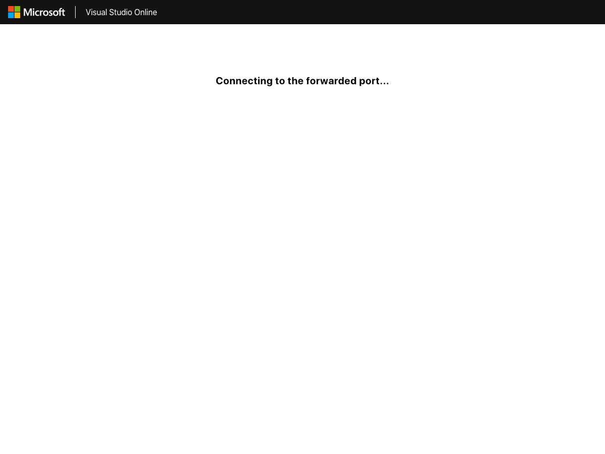

# VS Online meets Heroku

## Create a new repository

https://github.com/new


## Sign in to VS Online

https://online.visualstudio.com/login


## Create Environment


## Push code from VS Online


## Fix Node version to use

```bash
$ nvm install 12
```

## Implement web server

```bash
$ npm init
$ npm install express --save
```

app.js
```js
const express = require('express');
const app = express();
const port = 3000;

app.get('/', (req, res) => res.send('The app is running!'));

app.listen(port, () => console.log(`Example app listening on port ${port}!`));
```

package.json
```json
  "scripts": {
    "start": "node app"
  }
```

Run the server
```bash
$ npm start
```

## Test web server running on VS Online environment





## Make the webapp runnable on Heroku

app.js
```js
const port = process.env.PORT || 3000;
```

package.json
```json
  "engines": {
    "node": "12.x",
    "npm": "6.x"
  },
```

package.json (optional)
```json
  "scripts": {
    "start": "node app",
    "build": "echo What you need to run before starting the server such as webpack.",
    "heroku-postbuild": "echo Alternative of build. If specified, build won't be called.",
    "heroku-prebuild": "echo This runs before dependency installation.",
    "heroku-postbuild": "echo This runs after Heroku dependency installation."
  },
```
